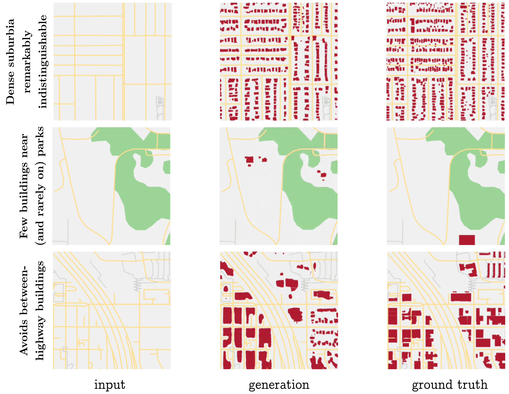

_Maxwell Forbes_ 
_CSE 557 Final Project Report_ 
_December 15, 2017_

[TOC]

## Introduction

### Motivation

Procedural generation affords the creation of large, authentic looking
environments with far less time and effort than manual modeling.

The domain of _urban_ procedural generation can be roughly split into three
sub-problems: layout modelling (maps and roads), building modelling (3D
geometries), and facade modelling (3D facades and
textures).[^vanegas2010modelling] Exciting advances in all of these areas have
led to remarkably realistic results, such as generating cities that expand over
time[^weber2009interactive] and villages that grow based on their
geography.[^emilien2012procedural]

While procedural generation offers great gains compared to manually creating
content, a key problem still exists: the designers of such generation systems
create the algorithms by manually designing and encoding grammars that produce
realistic looking results. This process requires substantial domain expertise
and significant trial and error. In other words, procedural generation does not
remove the manual effort required to generate large cities; it simply shifts
the effort from 3D modeling to algorithm design!

However, for city layouts, freely available data from crowdsourced map projects
now exist. From this data, it may be possible to train a machine learning model
that can automatically generate city layouts without any hand-tuned grammar
rules.

In addition to simply removing the manual work of designing generation
algorithms, a machine learning model offers other pragmatic advantages to
virtual city creators. For example, a model would learn to generate cities in
the _style_ of the geographic area on which it was trained. An old European
town will present different layout patterns than a bustling metropolis like
Tokyo. A machine learning model could capture these differences simply by being
retrained on different data, without needed to re-design the parameters or
grammars of the generation algorithm.

### Task

In this project, we approach the first domain of urban procedural generation:
generating the layout for a city. Within this domain, we further restrict our
focus to the following task: given a road network and city features (like water
and parks), fill in the buildings inside of blocks. Figure TODO shows a visual
depiction of our task.

 

_Figure TODO: Task overview: given a road network, we attempt to directly fill
in blocks with buildings._

 

We split this overall task into two subtasks. In the first subtask, we extract
individual blocks with their buildings laid out on top of them. The goal is to
generate the buildings for a single block at a time (Figure TODO, upper half).
This problem is more constrained, and provides an early test of the model's
capabilities.

In the second subtask, we provide a larger chunk of a city as input, and ask
the model to fill in buildings in all the empty blocks provided (Figure TODO,
lower half). This task is more difficult, because more buildings must be
generated and placed within the bounds of blocks. But because we also provide
geographic features like water and parks in the input, a model can potentially
take advantage of these semantic cues to generate layouts that are sensitive to
their surroundings.

 

_Figure TODO: The two tasks we consider. In both cases, buildings must be
generated on top of an input image. The difference is in the size of the region
and the amount of geographic context provided._

 

## Related Work

### Inverse Procedural Modeling _and_ Shape Learning

The idea of attempting to learn the parameters of a procedural generation model
is called _inverse procedural modeling_. Though this has never been applied to
city layout generation, it has been explored by several authors in other
domains.

Wu et al. (2014) learn a split grammar for facades, preferring shorter
descriptions as better representations of the grammar.[^wu2013inverse] Though
it does not appear to use machine learning, _Inverse Procedural Modeling by
Automatic Generation of L-Systems_ (2010) propose an approach for
reverse-engineering the parameters for an L-system (grammar) given input (in
their case, 2D vector images) that was generated from one.[^vst2010inverse]

Other authors have used graphical models to learn how to generate shapes and
textures. Fan and Wonka (2016) learned a garphical model to generate 3D
buildings and facades.[^fan2016probabilistic] Martinovic and Gool (2013) learn
a 2D context-free grammar (CFG) from a set of labeled
facades.[^martinovic2013bayesian] In _A Probabilistic Model for Component-Based
Shape Synthesis_ (2012), the authors learn a graphical model trained on
hand-modeled 3D shapes (like a dinosaur or a chair) in order to generate their
own novel meshes.[^kalogerakis2012probabilistic] Toshev et al. (2010) take
inspiration from classical natural language processing, and learn the
parameters of a parsing model to map point clouds that represent roofs to a
hierarchy of the roof's components (e.g., main roof, hood over window, shed
roof, etc.).[^toshev2010detecting]

### City Modeling

Though these works do not use machine learning or inverse procedural
generation, it is worth briefly touching upon city generation literature.
Several papers present tools for editing or expanding a set of aerial images of
cities. Aliaga et al. (2008, a) present a tool for making edits to an urban
layout and generate roads and parcels to fit into the edited
regions.[^aliaga2008interactiveA] In a followup work, Aglia et al. _(2008, b)_
demonstrate another tool that, given an example image, synthesizes a new street
network, and pastes in segments of the input image that fit well with the new
road network [^aliaga2008interactiveB].

Other work focuses on generating cities from scratch. Weber et al. (2009)
simulate a city's growth over time, taking into account population growth and
the according land use evolution.[^weber2009interactive] In _Procedural
Generation of Parcels in Urban Modeling_ (2012), the authors develop an
algorithm for automatically splitting blocks (the spaces carved out by road
networks) into parcels (areas of land ownership).[^vanegas2012procedural]
Finally, Nishida et al. (2016) present a tool for editing road networks that
takes into account the style and layout of example data.[^nishida2016example]

## Dataset Creation

To the best of our knowledge, no previous work attempt the task of generating
city layouts using machine learning. Because of this, a significant portion of
the project time was spent collecting and preprocessing the data. For that
reason, this section of the report gives a brief overview of this process.

### Task 1: Individual Blocks

The first task we address is: given a block, generate the buildings on the
block. For this task, we process maps data from OpenStreetMaps in order to
identify and extract blocks.

#### Overview

The overall processes of the block extraction is shown below in figure TODO.

 

_Figure TODO: Stages of block extraction, done for the first task. The
individual steps are described in the running text._

 

Block extraction broadly involved the following stages, each of which are
illustrated above (Figure TODO):

- (a) OpenStreetMaps data is parsed from its native XML format, and all
  _ways_ (collections of nodes) are rendered as polygons.

- (b) Crowdsourced labels are aggregated into high-level features (such as
  buildings and roads) and polygons are colored according to their predominant
  feature.

- (c) Roads are the only _ways_ that should not be rendered as polygons; they
  are properly drawn as polylines.

- (d) Nodes that serve as the underlying points for road _ways_ are rendered.

- (e) Road nodes are rendered in varying sizes to confirm that roads are drawn
  independently (i.e., informing us that intersections must be discovered).

- (f) Nodes are recursively collapsed by finding nodes within a geographic
  euclidean distance and recursively building a map of backpointers.

- (g) Now that nodes connect roads together, the map may be rendered as a
  graph, here shown in green and blue.

- (i) First stage of block discovery: blocks of small distance (up to four
  edges) are discovered, but duplicates exist because the same block may be
  discovered by multiple nodes.

- (j) Deduplication of identical blocks by keeping only unique sets of
  vertices. (Blocks are rendered with semi-transparency; the difference can be
  seen here from the last step because the blocks are a lighter shade of pink,
  indicating they only exist once.)

- (k) Increasing the maximum search depth of the block discovery algorithm, we
  begin to find larger sets of nodes that encompass multiple blocks (darker
  pink regions). Because some blocks are defined by a large number of nodes due
  to having curvy roads, some are still missed.

- (l) Further increasing the maximum block search depth, we recover all
  feasible blocks. At this point, heavy duplicate coverage plagues blocks due
  to the algorithm discovering many false enclosing blocks.

- (m) Removal of false enclosing blocks. This is done by rendering all
  candidate blocks and removing any large candidates that fully enclose smaller
  candidates.

#### Graph Ring Discovery

A crucial part of the above process was devising an algorithm to find rings in
the graph in order to identify candidate blocks. The algorithm is presented
below in Python-like pseudocode with types. It is an augmented breadth-first
search which tracks unique paths to vertices from paths starting at all
neighbors of a start vertex.

_NB: While presenting this algorithm, I was pointed to a simpler algorithm that
takes into account the the geometry of the map: for each edge, follow edges of
a maximum angle (e.g., clockwise) until the starting vertex is reached. For
completeness, I still present here the algorithm that I devised to find rings
in a graph._

 

    :::python
    # The overall algorithm searches from each vertex and returns the unique
    # set of rings discovered.
    def find_rings(graph: Dict[int, Set[int]]) -> List[List[int]]:
        return unique(find_rings_at(graph, n) for n in graph.keys())

    # The bulk of the algorithm finds all rings that involve a chosen vertex up
    # to a maximum depth.
    def find_rings_at(graph: Dict[int, Set[int]], start: int,
                      maxdepth: int) -> List[List[int]]:
        # Setup.
        start_path = [start]  # type: List[int]
        shortest = {}  # type: Dict[int, List[List[int]]]
        q = Queue([(start, start_path)])

        # First, find sets of unique paths to surrounding vertices.
        while len(q) > 0:
            # Consider the vertex just found, a candidate "shortest path."
            cur, curpath = q.pop()
            if can_add_to_shortest(cur, curpath, shortest):
                if cur not in shortest:
                    shortest[cur] = []
                shortest[cur].append(curpath)

            # Add neighbors to queue if we haven't explored to max depth yet.
            if len(curpath) < maxdepth:
                for neighbor in graph[cur]:
                    # No backtracking per path.
                    if neighbor not in curpath:
                        q.append((neighbor, curpath + [neighbor]))

        # Now, extract rings. They are discovered vertices with multiple paths.
        rings = []
        for candidate in shortest.keys():
            paths = shortest[candidate]
            if len(paths) > 1:
                # Use the first two paths found, and remove duplicate nodes
                # (first and last) from the second.
                p1 = paths[0]
                p2 = paths[1]
                rings.append(p1 + list(reversed(p2[1:-1])))

        return rings

    # This helper algorithm determines whether a candidate path should be added
    # to the set of shortest paths to a vertex.
    def can_add_to_shortest(cur: int, curpath: List[int],
                            shortest: Dict[int, List[List[int]]]) -> bool:
        # If shortest hasn't found cur yet, then found a new shortest path.
        if cur not in shortest:
            return True

        # Crowdsourced map data; might have multiple edges between two vertices.
        if len(curpath) == 2:
            return False

        # Interesting case: We want to add only if we've found a new path to
        # this node that is unique; i.e., the middle nodes (excluding start and
        # cur) have nothing in common with any other paths.
        middle = set(curpath[1:-1])
        for p in shortest[cur]:
            exist_middle = set(p[1:-1])
            if len(exist_middle.intersection(middle)) > 0:
                return False
        return True

_Algorithm 1: Ring discovery in a graph._

 

#### Block-Building Matching and Rendering

After discovering blocks, we then match each block to the set of buildings that
lie on top of that block. To do this, we perform a point-in-polygon test for
every vertex of every building onto the polygon defined by every block. While
this test is an approximation of a polygon-in-polygon test, it works well in
practice given the shape of blocks and buildings (there are no extreme, sharp
concavities in the blocks).

Finally, we pick a standard resolution, and transform all blocks and the
buildings on top of them to that fixed resolution output. We the use
Processing[^processing] to render all of the blocks in bulk, creating pairs of
(empty, populated) blocks, rendering blocks in grey and buildings in black.
Several example blocks are shown below in Figure TODO.

 

_Figure TODO: Four examples from the dataset for task 1: generating buildings
for a block. Whereas some blocks have distinct shapes around which buildings
must be placed (columns one and two), others provide almost no input but
require specific outputs (columns three and four). Currently, uniform scaling
per block results in a distorted appearance; this effect could be reversed in
postprocessing, or future approaches could clip blocks to geographic bounds
rather than scaling to a set pixel size._

 

We scrape five different regions of Seattle and extract all blocks with at
least one building on them, giving a total of 1100 images, which we partition
into train (521) / val (415) / test (164) splits such that the geographic
regions do not overlap between the splits.

### Task 2: Map Regions

The second task we address is: given a region of a map without any buildings,
generate all of the buildings.

This task is simpler from a dataset creation perspective, because it simply
involves rendering two versions of a map: one with most geographic features
rendered except buildings, and the second including buildings as well.

#### Rendering Regions

The main challenge in creating a more realistic region-filling dataset is
accurately rendering a broader range of geographic features. Recall in the
dataset for task 1 that we render only block outlines and buildings. For task
2, we can encode more context render other geographic features such as
walkways, parks, and water. The difficulty in doing so is that these features
are encoded with varying consistency, and at varying levels of abstraction.

Here are a few examples to illustrate how some features are labeled in the
OpenStreetMap data:

| Tag(s) | Actual Geographic Feature |
| --- | --- |
| highway: yes | highway |
| highway: path | pedestrian walkway |
| man_made: pier, source: Yahoo! | walking area |
| source: Yahoo! | water |
| water: yes | water |

After selecting a variety of regions and manually adding mappings between tags,
we end up with seven possible semantic categories per map that we render: (1)
nothing (light grey) (blocks are colored this way), (2) buildings (red
polygons), (3) roads (yellow lines), (4) water (blue polygons), (5) pedestrian
areas (darker grey polygons), (6) pedestrian walkways (darker grey lines), (7)
parks (green polygons). Four example renderings are shown below in Figure TODO:

 

_Figure TODO: Four example regions in the dataset for task 2. The dataset
exhibits a wide variety in the correct number of buildings in the output, as
can be seen by the second column, which should be left mostly blank.
Furthermore, note the presence of pedestrian footpaths around which buildings
should not be generated (left and rightmost columns), the presence of buildings
along the pier (third column), and the variety of block shapes around which
buildings must be placed (columns one versus four)._

 

#### Scraping

The only additional complication with rendering larger map segments is that the
amount of map data required is significantly greater. We address this by
building a small scraping pipeline that walks a given latitude, longitude
geographic region by fixed window sizes (chosen to render well onto a square
image).

We scrape a region encompassing the greater Seattle area: from the Puget Sound
(W) to Sammamish (E), and from SeaTac (S) to Mountlake Terrace (N). This
results in 2967 individual regions, which we filter to include only those with
at least one building. After filtering, 1880 regions remain, which we partition
into train (1680) / val (100) / test (100) splits.

## Model

We use the conditional adversarial network, proposed by Isola et al.
(2017).[^pix2pix]

This model trains two networks, a generator, and a discriminator. The generator
produces candidate output images, and the discriminator attempts to distinguish
between real output images and fake ones. They are trained together so that as
the generator produces more realistic images, the generator also gets better at
distinguishing them.

We use the same model presented in the paper by Isola et al., in which many
more details can be found. We briefly note here that GAN (generative
adversarial network) variants are notoriously difficult to train for two
reasons. The first is that they require a careful balance between the generator
and discriminator; if the discriminator is too effective, the generator can
never fool it, and receives no training signal, while the reverse is true if
the discriminator is easily tricked. The second is the problem of "mode
collapse," which happens when the generator finds a single output that the
discriminator believes, and simply produces that identical output continuously.
The second issue is less prevalent in conditional GANs, because the
discriminator also receives the input; however, in our particular dataset, many
inputs look identical, especially for the first task (there are many uniform
grey squares as input).

## Experimental Results and Discussion

### Task 1

At the beginning of training, the model has trouble producing coherent shapes,
and has not yet learned that it should only output one of three color values.
This can be seen in Figure TODO, with the multicolor banding on the right side
of the image. It is able to immediately learn to reproduce the grey outline of
the input block, and never draws black (buildings) on top of white (empty
space).

 

_Figure TODO: Task 1, after 1 epoch (pass over training data)._

 

After nine epochs, the model is able to produce more ambitious shapes (Figure
TODO), but the shapes are too densely connected and rounded to be convincing
enough to fool a human judge.

 

_Figure TODO: Task 1, after 9 epochs._

 

By the the end of training model is able to generate fairly convincing
filled-in blocks. It is interesting to note that the L1 loss does not drop
after about ten epochs, but the visual quality continues to improve. This can
be understood by looking at one of the final outputs, in Figure TODO. Without
the gold output (far right), it would be difficult to tell whether the
generation (middle) is correct. In that sense, it may well fool a
discriminator, human or neural network. However, the L1 distance from the
generated image to the gold is terrible, as it got the buildings almost
completely wrong.

 

_Figure TODO: Task 1, after 193 epochs. (The model was trained for 200 epochs
in total.)_

 

#### Mode collapse

One question we were interested to investigate is: does the conditional
adversarial network suffer from mode collapse in this task?

During the middle of training, we observed what appeared to be mode collapse,
as can be seen in Figure TODO. The model repeatedly generates a single building
near the bottom of the image.

 

_Figure TODO: Task 1, experiencing possible mode collapse at a handful of earlier
epochs._

 

Though this effect is understandable given the potential confounding inputs
(all grey boxes), the model exits this behavior after more training. We would
be interested in disentangling what aspect of the training helped remedy
this—was it the optimization method? The discriminator "catching up" to the
mode? Or simply the L1 loss?—but we would need to conduct ablations and
further model analysis to propose an answer to this question.

### Task 2

Similar to with task 1, the model is able to pick up on copying general
background shapes over to the output by the end of epoch 1, though the results
are fuzzy, and it has trouble producing buildings (Figure TODO).

 

_Figure TODO: Task 2, after 1 epoch._

 

By a few dozen epochs in, the model faithfully copies over the non-building
context, and generates buildings in largely the appropriate places. However, at
this point it prefers larger blobs in as many spots as possible, producing cellular-looking outputs that are easily recognized as fake (Figure TODO).

 

_Figure TODO: Task 2, after 44 epochs._

 

By the end of training, the model has reached generally decent performance on
many of the inputs. Figure TODO shows the model after its final 200th epoch of
training, generating a remarkably faithful output compared to the gold.

 

_Figure TODO: Task 2, the final model after 200 epochs._

 

#### Success cases

There are a few cases that the model can handle very well, shown in the three
rows in Figure TODO. The first row demonstrates the situation where the model
excels the most: in regular, dense, suburban grids. This is likely due to the
large quantity of similarly structured examples in the training set, as well as
the uniformity of the output being both regular (for the model) and difficult
for human eyes to distinguish (for subjective quality).

The second row shows a geographic pattern the model has learned: near parks,
there are few buildings. The buildings that exist near parks are also rarely on
the parks themselves (with rare exceptions being visitor centers).

The third row shows a seemingly trivial but interesting pattern the model has
learned: that buildings do not go between freeway roads.

 

_Figure TODO: Task 2, three patterns the model has learned to reproduce well._

 

#### Failure cases

The model is of course not without its shortcomings. Figure TODO illustrates
two of the main problems that plague the model even after it is fully trained.
In the first row we see that the model still generates blobs for buildings,
especially in-between curvy blocks. The second row demonstrates visual
artifacts that make the model often easy to spot by human eyes: the white
banding in the green park area, and the color mixtures around the long vertical
grey lines.

 

_Figure TODO: Task 2, two problems the model has even after training._

 

#### Unpredictable Sparsity

Some of the most frequent failures cases for the model were arguably not due to
shortcomings of the model itself, but the unpredictability of the task. Figure
TODO shows the sparsity / density issue happening in both directions. Some road
networks, though seemingly regular and residential, in fact have no buildings
in them, and so the model guesses completely wrong (first row). On the other
hand, other road networks that appear to possibly be barren industrial areas
near a highway are actually densely lined, and the model guesses the wrong way
by leaving them empty (bottom row).

 

_Figure TODO: Task 2, sparsity (or density) that is difficult to predict._

 

It may be worth taking a careful pass over several more samples of the dataset
to ensure that the above sparse blocks are truly empty. One possibility is that
there are other geographic landmarks (such as military areas, cemetaries, or
railroad tracks) that would either explain the emptiness, or provide clues for
the model to better determine when it should leave regions unoccupied.

## Conclusion

We presented what is, to our knowledge, the first attempt to generate urban
city layouts using machine learning. We collected two "fill in the buildings"
datasets by generating custom renderings from geographic data. We showed that
conditional adversarial network models perform surprisingly well on both tasks,
often producing plausible results even in the absence of truly sufficient
information. Our code is open source,[^githubmapgen] and we would happily make
the data available as well upon request.

In the future, we are eager to explore two lines of work. The first natrual
extension is to improve the current approach. More exhaustive feature mapping
would allow us to more completely capture inconsistently labeled regions like
parks and waterways, and finer grained feature rendering would allow us to
differentiate more _waypoint_ types, such as freeways, arterials, and side
streets. Modifying the model to account for task-specific constraints—such as
that buildings have straight edges and are closed polygons—would produce even
more realistic results. Training on multiple cities and observing the style
differences the model picks up would be an interesting application of the work
already done. And, of course, the current approach provides the road network as
input; an even greater challenge would be to generate the roads as well (though
this would likely move beyond the limits of the current model).

Even more exciting to us is the second line of future work, which is to learn
models inspired by traditional approaches to procedural map generation:
probabilistic grammars. While this approach would be less likely to produce
visually impressive results as quickly as the current model, it would stay more
true to the intent of procedural generation, which is to create systems that
_grow_ rather than _fill in_. Unsupervised grammar induction, while daunting,
has precedent in natural language processing. Grammar learning would also
transfer more easily to generating other features (roads, water, parks) than
would the model proposed in this paper.

 

[^vanegas2010modelling]: Carlos A Vanegas, Daniel G Aliaga, Peter Wonka, Pascal
Müller, Paul Waddell, and Benjamin Watson. _Modelling the appearance and
behaviour of urban spaces._ In Computer Graphics Forum, volume 29, pages 25–42.
Wiley Online Library, 2010.

[^weber2009interactive]: Basil Weber, Pascal Mu ̈ller, Peter Wonka, and Markus
Gross. _Interactive geometric simulation of 4d cities._ In Computer Graphics
Forum, volume 28, pages 481–492. Wiley Online Library, 2009.

[^emilien2012procedural]: Arnaud Emilien, Adrien Bernhardt, Adrien Peytavie,
Marie-Paule Cani, and Eric Galin. _Procedural generation of villages on
arbitrary terrains._ The Visual Computer, 28(6-8):809– 818, 2012.

[^wu2013inverse]: Fuzhang Wu, Dong-Ming Yan, Weiming Dong, Xiaopeng Zhang, and
Peter Wonka. _Inverse procedural modeling of facade layouts._ arXiv preprint
arXiv:1308.0419, 2013.

[^vst2010inverse]: Ondrej Sˇt’ava, Bedrich Beneˇs, Radomir Mˇech, Daniel G
Aliaga, and Peter Kriˇstof. _Inverse procedural modeling by automatic
generation of l-systems._ In Computer Graphics Forum, volume 29, pages 665–674.
Wiley Online Library, 2010.

[^fan2016probabilistic]: Lubin Fan and Peter Wonka. _A probabilistic model for
exteriors of residential buildings._ ACM Transactions on Graphics (TOG),
35(5):155, 2016.

[^martinovic2013bayesian]: Andelo Martinovic and Luc Van Gool. _Bayesian
grammar learning for inverse procedural modeling._ In Proceedings of the IEEE
Conference on Computer Vision and Pattern Recognition, pages 201–208, 2013.

[^kalogerakis2012probabilistic]: Evangelos Kalogerakis, Siddhartha Chaudhuri,
Daphne Koller, and Vladlen Koltun. _A probabilistic model for component-based
shape synthesis._ ACM Transactions on Graphics (TOG), 31(4):55, 2012.

[^toshev2010detecting]: Alexander Toshev, Philippos Mordohai, and Ben Taskar.
_Detecting and parsing architecture at city scale from range data._ In Computer
Vision and Pattern Recognition (CVPR), 2010 IEEE Conference on, pages 398–405.
IEEE, 2010.

[^aliaga2008interactiveA]: Daniel G Aliaga, Bedˇrich Beneˇs, Carlos A Vanegas,
and Nathan Andrysco. _Interactive reconfiguration of urban layouts._ IEEE
Computer Graphics and Applications, 28(3), 2008.

[^aliaga2008interactiveB]: Daniel G Aliaga, Carlos A Vanegas, and Bedrich
Benes. _Interactive example-based urban layout synthesis._ In ACM transactions
on graphics (TOG), volume 27, page 160. ACM, 2008.

[^vanegas2012procedural]: Carlos A Vanegas, Tom Kelly, Basil Weber, Jan
Halatsch, Daniel G Aliaga, and Pascal Müller. _Procedural generation of parcels
in urban modeling._ In Computer graphics forum, volume 31, pages 681–690. Wiley
Online Library, 2012.

[^nishida2016example]: Gen Nishida, Ignacio Garcia-Dorado, and Daniel G Aliaga.
_Example-driven procedural urban roads._ In Computer Graphics Forum, volume 35,
pages 5–17. Wiley Online Library, 2016.

[^pix2pix]: Philip Isola, Jun-Yan Zhu, Tinghui Zhou, and Alexei A. Efros.
_Image-to-image translation with conditional adversarial networks._ In CVPR,
2017.

[^Processing]: https://processing.org/

[^githubmapgen]: https://github.com/mbforbes/mapgen
