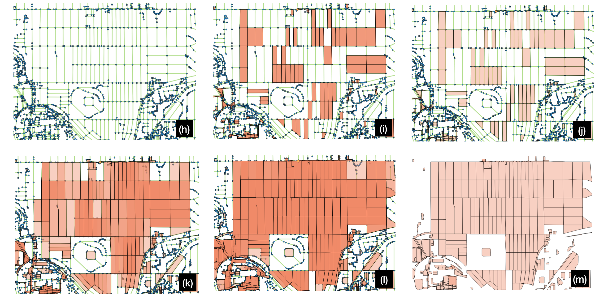
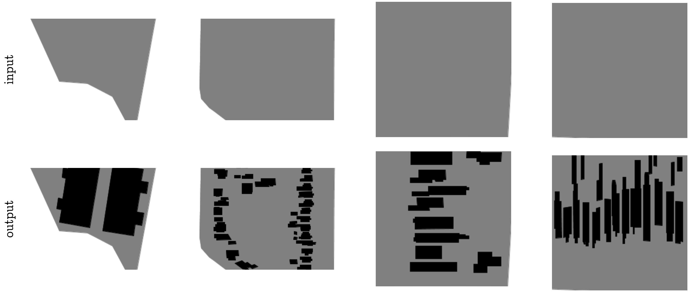

_Maxwell Forbes_ 
_CSE 557 Final Project Report_ 
_December 15, 2017_

[TOC]

## Introduction

### Motivation

Procedural generation affords the creation of large, authentic looking
environments with far less time and effort than manual modeling.

The domain of _urban_ procedural generation can be roughly split into three
sub-problems: layout modelling (maps and roads), building modelling (3D
geometries), and facade modelling (3D facades and textures)
\cite{vanegas2010modelling}. Exciting advances in all of these areas have led
to remarkably realistic results, such as generating cities that expand over
time \cite{weber2009interactive} and villages that grow based on their
geography \cite{emilien2012procedural}.

While procedural generation offers great gains compared to manually creating
content, a key problem still exists: the designers of such generation systems
create the algorithms by manually designing and encoding grammars that produce
realistic looking results. This process requires substantial domain expertise
and significant trial and error. In other words, procedural generation does not
remove the manual effort required to generate large cities; it simply shifts
the effort from 3D modeling to algorithm design!

However, for city layouts, freely available data from crowdsourced map projects
now exist. From this data, it may be possible to train a machine learning model
that can automatically generate city layouts without any hand-tuned grammar
rules.

In addition to simply removing the manual work of designing generation
algorithms, a machine learning model offers other pragmatic advantages to
virtual city creators. For example, a model would learn to generate cities in
the _style_ of the geographic area on which it was trained. An old European
town will present different layout patterns than a bustling metropolis like
Tokyo. A machine learning model could capture these differences simply by being
retrained on different data, without needed to re-design the parameters or
grammars of the generation algorithm.

### Task

In this project, we approach the first domain of urban procedural generation:
generating the layout for a city. Within this domain, we further restrict our
focus to the following task: given a road network and city features (like water
and parks), fill in the buildings inside of blocks. Figure TODO shows a visual
depiction of our task.

TODO: figure for task

We split this overall task into two subtasks. In the first subtask, we extract
individual blocks with their buildings laid out on top of them. The goal is to
generate the buildings for a single block at a time (Figure TODO (a)). This
problem is more constrained, and provides an early test of the model's
capabilities.

In the second subtask, we provide a larger chunk of a city as input, and ask
the model to fill in buildings in all the empty blocks provided (Figure TODO
(b)). This task is more difficult, because more buildings must be generated and
placed within the bounds of blocks. But because we also provide geographic
features like water and parks in the input, a model can potentially take
advantage of these semantic cues to generate layouts that are sensitive to
their surroundings.

TODO: figure both subtasks

## Related Work

### Inverse Procedural Modeling _and_ Shape Learning

The idea of attempting to learn the parameters of a procedural generation model
is called _inverse procedural modeling_. Though this has never been applied to
city layout generation, it has been explored by several authors in other
domains.

Wu et al. (2014) learn a split grammar for facades, preferring shorter
descriptions as better representations of the grammar \cite{wu2013inverse}.
Though it does not appear to use machine learning, _Inverse Procedural Modeling
by Automatic Generation of L-Systems_ (2010) propose an approach for
reverse-engineering the parameters for an L-system (grammar) given input (in
their case, 2D vector images) that was generated from one
\cite{vst2010inverse}.

Other authors have used graphical models to learn how to generate shapes and
textures. Fan and Wonka (2016) learned a garphical model to generate 3D
buildings and facades \cite{fan2016probabilistic}. Martinovic and Gool (2013)
learn a 2D context-free grammar (CFG) from a set of labeled facades. In _A
Probabilistic Model for Component-Based Shape Synthesis_ (2012)
\cite{kalogerakis2012probabilistic}, the authors learn a graphical model
trained on hand-modeled 3D shapes (like a dinosaur or a chair) in order to
generate their own novel meshes. Toshev et al. (2010) take inspiration from
classical natural language processing, and learn the parameters of a parsing
model to map point clouds that represent roofs to a hierarchy of the roof's
components (e.g., main roof, hood over window, shed roof, etc.)
\cite{toshev2010detecting}.

### City Modeling

Though these works do not use machine learning or inverse procedural
generation, it is worth briefly touching upon city generation literature.
Several papers present tools for editing or expanding a set of aerial images of
cities. Aliaga et al. (2008, a) present a tool for making edits to an urban
layout and generate roads and parcels to fit into the edited regions
\cite{aliaga2008interactiveA}. In a followup work _(Aglia et al., 2008 b)_
demonstrate another tool that, given an example image, synthesizes a new street
network, and pastes in segments of the input image that fit well with the new
road network \cite{aliaga2008interactiveB}.

Other work focuses on generating cities from scratch. Weber et al. (2009)
simulate a city's growth over time, taking into account population growth and
the according land use evolution \cite{weber2009interactive}. In _Procedural
Generation of Parcels in Urban Modeling_ (2012) \cite{vanegas2012procedural},
the authors develop an algorithm for automatically splitting blocks (the spaces
carved out by road networks) into parcels (areas of land ownership). Finally,
Nishida et al. (2016) present a tool for editing road networks that takes into
account the style and layout of example data \cite{nishida2016example}.

## Dataset Creation

To the best of our knowledge, no previous work attempt the task of generating
city layouts using machine learning. Because of this, a significant portion of
the project time was spent collecting and preprocessing the data. For that
reason, this section of the report gives a brief overview of this process.

### Task 1: Individual Blocks

The first task we address is: given a block, generate the buildings on the
block. For this task, we process maps data from OpenStreetMaps in order to
identify and extract blocks.

#### Overview

The overall processes of the block extraction is shown below in figure TODO.

 

_Figure TODO: Stages of block extraction, done for the first task. The
individual steps are described in the running text._

 

Block extraction broadly involved the following stages, each of which are
illustrated above (Figure TODO):

- (a) OpenStreetMaps data is parsed from its native XML format, and all
  _ways_ (collections of nodes) are rendered as polygons.

- (b) Crowdsourced labels are aggregated into high-level features (such as
  buildings and roads) and polygons are colored according to their predominant
  feature.

- (c) Roads are the only _ways_ that should not be rendered as polygons; they
  are properly drawn as polylines.

- (d) Nodes that serve as the underlying points for road _ways_ are rendered.

- (e) Road nodes are rendered in varying sizes to confirm that roads are drawn
  independently (i.e., informing us that intersections must be discovered).

- (f) Nodes are recursively collapsed by finding nodes within a geographic
  euclidean distance and recursively building a map of backpointers.

- (g) Now that nodes connect roads together, the map may be rendered as a
  graph, here shown in green and blue.

- (i) First stage of block discovery: blocks of small distance (up to four
  edges) are discovered, but duplicates exist because the same block may be
  discovered by multiple nodes.

- (j) Deduplication of identical blocks by keeping only unique sets of
  vertices. (Blocks are rendered with semi-transparency; the difference can be
  seen here from the last step because the blocks are a lighter shade of pink,
  indicating they only exist once.)

- (k) Increasing the maximum search depth of the block discovery algorithm, we
  begin to find larger sets of nodes that encompass multiple blocks (darker
  pink regions). Because some blocks are defined by a large number of nodes due
  to having curvy roads, some are still missed.

- (l) Further increasing the maximum block search depth, we recover all
  feasible blocks. At this point, heavy duplicate coverage plagues blocks due
  to the algorithm discovering many false enclosing blocks.

- (m) Removal of false enclosing blocks. This is done by rendering all
  candidate blocks and removing any large candidates that fully enclose smaller
  candidates.

#### Graph Ring Discovery

A crucial part of the above process was devising an algorithm to find rings in
the graph in order to identify candidate blocks. The algorithm is presented
below in Python-like pseudocode with types. It is an augmented breadth-first
search which tracks unique paths to vertices from paths starting at all
neighbors of a start vertex.

_NB: While presenting this algorithm, I was pointed to a simpler algorithm that
takes into account the the geometry of the map: for each edge, follow edges of
a maximum angle (e.g., clockwise) until the starting vertex is reached. For
completeness, I still present here the algorithm that I devised to find rings
in a graph._

 

    :::python
    # The overall algorithm searches from each vertex and returns the unique
    # set of rings discovered.
    def find_rings(graph: Dict[int, Set[int]]) -> List[List[int]]:
        return unique(find_rings_at(graph, n) for n in graph.keys())

    # The bulk of the algorithm finds all rings that involve a chosen vertex up
    # to a maximum depth.
    def find_rings_at(graph: Dict[int, Set[int]], start: int,
                      maxdepth: int) -> List[List[int]]:
        # Setup.
        start_path = [start]  # type: List[int]
        shortest = {}  # type: Dict[int, List[List[int]]]
        q = Queue([(start, start_path)])

        # First, find sets of unique paths to surrounding vertices.
        while len(q) > 0:
            # Consider the vertex just found, a candidate "shortest path."
            cur, curpath = q.pop()
            if can_add_to_shortest(cur, curpath, shortest):
                if cur not in shortest:
                    shortest[cur] = []
                shortest[cur].append(curpath)

            # Add neighbors to queue if we haven't explored to max depth yet.
            if len(curpath) < maxdepth:
                for neighbor in graph[cur]:
                    # No backtracking per path.
                    if neighbor not in curpath:
                        q.append((neighbor, curpath + [neighbor]))

        # Now, extract rings. They are discovered vertices with multiple paths.
        rings = []
        for candidate in shortest.keys():
            paths = shortest[candidate]
            if len(paths) > 1:
                # Use the first two paths found, and remove duplicate nodes
                # (first and last) from the second.
                p1 = paths[0]
                p2 = paths[1]
                rings.append(p1 + list(reversed(p2[1:-1])))

        return rings

    # This helper algorithm determines whether a candidate path should be added
    # to the set of shortest paths to a vertex.
    def can_add_to_shortest(cur: int, curpath: List[int],
                            shortest: Dict[int, List[List[int]]]) -> bool:
        # If shortest hasn't found cur yet, then found a new shortest path.
        if cur not in shortest:
            return True

        # Crowdsourced map data; might have multiple edges between two vertices.
        if len(curpath) == 2:
            return False

        # Interesting case: We want to add only if we've found a new path to
        # this node that is unique; i.e., the middle nodes (excluding start and
        # cur) have nothing in common with any other paths.
        middle = set(curpath[1:-1])
        for p in shortest[cur]:
            exist_middle = set(p[1:-1])
            if len(exist_middle.intersection(middle)) > 0:
                return False
        return True

_Algorithm 1: Ring discovery in a graph._

 

#### Block-Building Matching and Rendering

After discovering blocks, we then match each block to the set of buildings that
lie on top of that block. To do this, we perform a point-in-polygon test for
every vertex of every building onto the polygon defined by every block. While
this test is an approximation of a polygon-in-polygon test, it works well in
practice given the shape of blocks and buildings (there are no extreme, sharp
concavities in the blocks).

Finally, we pick a standard resolution, and transform all blocks and the
buildings on top of them to that fixed resolution output. We the use
Processing[^processing] to render all of the blocks in bulk, creating pairs of
(empty, populated) blocks, rendering blocks in grey and buildings in black. A
few example blocks are shown below in Figure TODO.

 

_Figure TODO: Three examples from the dataset for task 1: generating buildings
for a block._

 

We scrape five different regions of Seattle and extract all blocks with at
least one building on them, giving a total of 1100 images, which we partition
into train (521) / val (415) / test (164) splits such that the geographic
regions do not overlap between the splits.

### Task 2: Map Regions

The second task we address is: given a region of a map without any buildings,
generate all of the buildings.

This task is simpler from a dataset creation perspective, because it simply
involves rendering two versions of a map: one with most geographic features
rendered except buildings, and the second including buildings as well.

#### Rendering Regions

The main challenge in creating a more realistic region-filling dataset is
accurately rendering a broader range of geographic features. Recall in the
dataset for task 1 that we render only block outlines and buildings. For task
2, we can encode more context render other geographic features such as
walkways, parks, and water. The difficulty in doing so is that these features
are encoded with varying consistency, and at varying levels of abstraction.

Here are a few examples to illustrate how some features are labeled in the
OpenStreetMap data:

| Tag(s) | Actual Geographic Feature |
| --- | --- |
| highway: yes | highway |
| highway: path | pedestrian walkway |
| man_made: pier, source: Yahoo! | walking area |
| source: Yahoo! | water |
| water: yes | water |

After selecting a variety of regions and manually adding mappings between tags,
we end up with seven possible semantic categories per map that we render: (1)
nothing (light grey) (blocks are colored this way), (2) buildings (red
polygons), (3) roads (yellow lines), (4) water (blue polygons), (5) pedestrian
areas (darker grey polygons), (6) pedestrian walkways (darker grey lines), (7)
parks (green polygons). Two example renderings are shown below in Figure TODO:

 

_Figure TODO: Two example regions in the dataset for task 2._

 

### Scraping

The only additional complication with rendering larger map segments is that the
amount of map data required is significantly greater. We address this by
building a small scraping pipeline that walks a given latitude, longitude
geographic region by fixed window sizes (chosen to render well onto a square
image).

We scrape a region encompassing the greater Seattle area: from the Puget Sound
(W) to Sammamish (E), and from SeaTac (S) to Mountlake Terrace (N). This
results in 2967 individual regions, which we filtered to include only those
with at least one building.

TODO: final numbers, also MB size, and splits

[^Processing]: https://processing.org/
